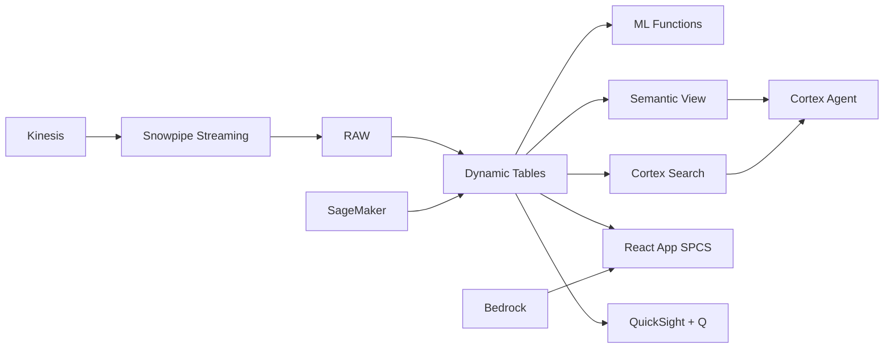

# Financial Inclusion & Micro-lending Analytics

46% of Filipino adults remain unbanked — Snowflake enables alternative credit scoring using remittance history and digital behavior, expanding lending access to millions through ML.CLASSIFICATION on non-traditional data.

## Architecture

46% of Filipino adults — 51 million people — have no bank account and no traditional credit score. They're invisible to conventional lenders. But they receive remittances, use e-wallets, and pay mobile bills. A Philippine micro-lender uses these alternative data signals to build credit scores for the unbanked, processing 380,000 loan applications using ML.CLASSIFICATION on remittance frequency, wallet behavior, and telco payment patterns.



## Snowflake Capabilities

| Capability | Implementation |
|-----------|---------------|
| Dynamic Tables | ALT_CREDIT_FEATURES / PORTFOLIO_HEALTH / INCLUSION_METRICS / MODEL_MONITORING |
| ML Functions | ML.CLASSIFICATION + ML.TOP_INSIGHTS |
| Cortex AI | COMPLETE, AI_CLASSIFY |
| Cortex Search | 82 documents indexed |
| Cortex Agent | INCLUSION_INTELLIGENCE_AGENT |
| Semantic View | INCLUSION_ANALYTICS |
| React App (SPCS) | 5 tabs + DemoGuide |


## AWS Services

| Service | Role in Demo |
|---------|-------------|
| Amazon SageMaker | Train and deploy alternative credit scoring model |
| Amazon Kinesis | Stream wallet and telco behavior signals |
| Amazon Bedrock (Claude) | Generate explainable credit decisions for regulators |
| Amazon SES | Send loan approval/denial notifications |
| Amazon QuickSight + Q | Lending analytics and inclusion dashboards |
| AWS Glue | ETL for multi-source alternative data |


## Personas

| Persona | Role | Key Questions |
|---------|------|---------------|
| **Rosario Elena Madrigal** | Chief Lending Officer | "What's our current default rate by borrower segment?" "How many unbanked Filipinos have we served this quarter?" |
| **Carlo Miguel Araneta** | Credit Risk Data Scientist | "What's the Gini coefficient of our alt-credit model?" "Show me approval rates by province — is there geographic bias?" |


## Data

| Table | Rows | Description |
|-------|------|-------------|
| BORROWER_PROFILES | 380,000 | Micro-loan applicants with demographic and KYC data |
| REMITTANCE_HISTORY | 2,800,000 | 12 months remittance receiving patterns (frequency, amount, source) |
| WALLET_BEHAVIOR | 4,200,000 | E-wallet transaction patterns (top-ups, bills, savings) |
| TELCO_SIGNALS | 1,500,000 | Mobile usage data (airtime load, data usage, payment history) |
| LOAN_PORTFOLIO | 145,000 | Active and historical loan records |
| REPAYMENT_RECORDS | 870,000 | Loan repayment history with status (on-time, late, default) |
| BSP_INCLUSION_DATA | 82 | BSP financial inclusion survey data by region |


## Build Instructions

### Prerequisites
- Snowflake account with ACCOUNTADMIN access
- Cortex AI enabled (ML Functions, Search, Agent)
- Warehouse: INCLUSION_WH (Medium)
- AWS CLI with access (us-west-2)

### Deployment

```bash
snowsql -f snowflake/00_setup.sql
snowsql -f snowflake/01_marketplace_install.sql
snowsql -f snowflake/02_raw_tables.sql
snowsql -f snowflake/03_staging.sql
snowsql -f snowflake/04_dynamic_tables.sql
snowsql -f snowflake/05_search.sql
snowsql -f snowflake/06_ml_models.sql
snowsql -f snowflake/07_semantic_view.sql
snowsql -f snowflake/08_agent.sql
```

### React App (SPCS)
```bash
cd app && npm ci && npm run build
docker build -t aws-philippines-remittance-inclusion-app .
docker push bdiqc8sm-default.registry.snowflakecomputing.com/financial_inclusion/app/aws_philippines_remittance_inclusion/app:latest
```

### Demo Mode
Open the app URL with `?demo=true` for presenter view.

## Build Modes

### Snowflake Only
Run scripts 00-08 (skip AWS-specific integration). Uses:
- **ML.CLASSIFICATION (native)** instead of Amazon SageMaker
- **Snowpipe Streaming SDK** instead of Amazon Kinesis
- **Cortex Complete** instead of Amazon Bedrock (Claude)
- **Alerts + Notification Integration (Email)** instead of Amazon SES
- **Snowflake Intelligence (Cortex Analyst)** instead of Amazon QuickSight + Q
- **Dynamic Tables (declarative pipelines)** instead of AWS Glue

### Full AWS + Snowflake
Run all scripts including AWS integration. Deploy QuickSight dashboard from `quicksight/`.

## Business Impact

Industry research and Snowflake customer outcomes:
- **46% of Filipino adults (51M people) remain unbanked as of 2023** — [BSP Financial Inclusion Survey](https://www.bsp.gov.ph/Pages/InclusiveFinance/Financial-Inclusion.aspx)
- **Alternative credit scoring expands lending access by 40-60% in emerging markets** — [World Bank](https://www.worldbank.org/en/topic/financialinclusion/publication/the-global-findex-database-2021)
- **Philippine micro-lending market grew 45% in 2023 driven by digital lenders** — [SEC Philippines](https://www.sec.gov.ph/lending-companies/)
- **ML-based credit scoring reduces default rates 20-30% vs traditional scorecards** — [McKinsey Banking](https://www.mckinsey.com/industries/financial-services/our-insights)


## Key Demo Numbers

- **380,000** borrowers served (65% previously unbanked)
- **₱8.2B** total loan portfolio outstanding
- **3.8%** overall default rate (below 5% target)
- **42% more approvals** vs traditional bureau scoring
- **0.62 Gini** coefficient for alt-credit model
- **51M Filipinos** unbanked — addressable market


## License

Apache 2.0 — See [LICENSE](LICENSE) for details.

This is a personal demo project and is not an official Snowflake offering. It comes with no support or warranty.